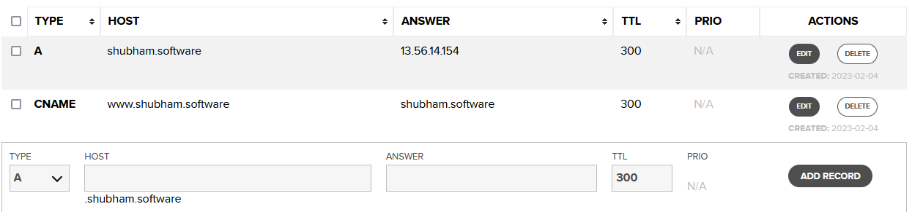

# shubham.software
This project requires me to set up the foundational components for their own web site, including a cloud service, domain, web server, and basic site components. The domain should be registered through a domain registrar, i did it free from name.com (github pro advantage). Created a separate Amazon cloud for the course, so that the credentials can be checked by prof. In Amazon EC2, I set up a basic Linux Ubuntu instance, and install Apache webserver, MySQL, PHP. The domain should then be pointed to the Amazon EC2 VM in the domain manager's DNS settings. For the second part of the assignment, I created an "about me" homepage for their domain, using HTML5 semantic elements and structure, with at least one video, one figure with caption, a background image, and navigation. The final part of the assignment requires securing the site with HTTPS using a free SSL certificate from LetsEncrypt, but did the manual certification through cloud fare.

### Step 1:
Created an ec2 instance on aws, i.e a basic linux ubuntu instance.


* Changed the security settings for the key. 
  * Right-click on the target file and select properties then select Security Tab
  * Click Advanced and then make sure inheritance is disabled.
  * Click apply and then click Edit in the security menu.
  * Remove all users except Admin user, which should have full control *Admin account should have all checkboxes checked on Allow column except special permission.
  * Click Apply and then click OK.
  * Or can follow this video: https://youtu.be/9ATMOTNWqZM
 
  
* connected that instance on CMD through:
```python
icacls.exe shubham.sotwarekey.pem /reset
icacls .\shubham.sotwarekey.pem /grant:r "%username%":"(R)"
icacls.exe shubham.sotwarekey.pem /inheritance:r
ssh -i shubham.sotwarekey.pem ubuntu@ec2-13-56-14-154.us-west-1.compute.amazonaws.com
```

* Install apache2
* Now if apache2 is installed then you can see your page on public ipv4 through http://13.56.14.154/ (this is http).

 ### Step 2:
* Register your domain on name.com and enter the details like this:


* Created a website.
* Copy the content of the website to virtual ubuntu through:
```python
sudo scp -r -i shubham.sotwarekey.pem shubham.website ubuntu@ec2-13-56-14-154.us-west-1.compute.amazonaws.com:
```
* Here shubham.website is the foldername which you want to copy to ubuntu.
* Now you have to copy that folder to destination inside:
```python
sudo mv /home/ubuntu/shubham.website /var/www/html
sudo mv shubham.wesbite/* ./
sudo rm -r shubham.website
```
* Follow this step for manual ssl certification: https://youtu.be/DJgxgOvK9Ig.
